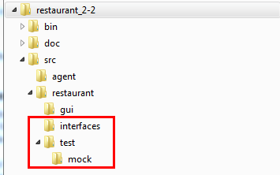
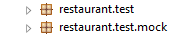

#CSCI 201 Unit Testing Lab &mdash; Restaurant v2.2
Now that you have some code written for your restaurant project, it is time to unit test your code. However, we must do a couple things to prepare your current code for unit testing first.

###Directory Structure
You will be adding a couple of new folders (boxed in red) to your project hierarchy. Below is a picture of the desired folder structure for your project:



  + `interfaces` directory: This directory will contain the common interfaces that your agents and mocks will share (we will discuss these below).

  + `test` directory: This directory will contain everything to do with your unit tests, including the tests themselves as well as the directory for the mocks you'll need.
  
  + `test/mock` directory: This directory will contain your mocks and any other related classes you need to support the mock environment for your unit tests (i.e.: the Log classes and the Mock superclass).

If you import this sort of structured directory into Eclipse, it will separate your code into packages nicely for you (represented by the brown box image in the Project Explorer).



###Interfaces
As discussed in lecture, you will need to extract out the messages that each agent responds to into an interface in order to create a "common language" for both your real agents and mocks to follow. By using an interface, your code will no longer care if it is dealing with a mock or a real agent!

Once you have created an interface, you must refactor your code to expect instances of this interface instead of the agent. For example, in order to unit test the `CashierAgent`, we will need to tell it to interact with `Customer` objects (not `CustomerAgents`) and `Waiter` objects (not `WaiterAgents`).

For example, here is a message the `CashierAgent` receives from a customer:

```java
public void ReadyToPay(CustomerAgent c, Bill b){
	...
}
```

It should now change to:

```java
public void ReadyToPay(Customer c, Bill b){
	...
}
```

By making the above change, the method will be able to accept either a `CustomerAgent` OR a `MockCustomer`. Why? Because both `CustomerAgent` objects and `MockCustomer` objects implement the `Customer` interface! This is great, because now we don't have to change our agent code when we want to unit test it – it will never know whether it is being unit tested or if it is actually running the restaurant simulation.

You should make these changes throughout the `CashierAgent` for each type of agent it interacts with (`Customer` and `Waiter`). Make sure to import the interfaces you reference.

You must also change the signature of the `CashierAgent` to read:

```java
public class CashierAgent extends Agent implements Cashier {
	...
}
```

Your mocks will have signatures like:

```java
public class MockCustomer extends Mock implements Customer {
	...
}
```

You will get a sample of a `MockCustomer`.

Once you have taken out all old references to `CustomerAgent` objects from your `CashierAgent`, you should do the same thing for every other agent the `CashierAgent` interacts with! For each additional agent the cashier will interact with, you'll need a new interface, a new mock, and you'll have to write some of this refactored code.


###Supporting Files for Unit Testing
You have been provided with some files to help get you started. They are stored in folders that reflect the suggested hierarchy in this repository.

  1. `EventLog.java` &ndash; A collection of LoggedEvent objects.

  1. `LoggedEvent.java` &ndash; Represents one event. Contains a string to describe the event that can be checked later.
  
  1. `Mock.java` &ndash; A superclass for all your mocks. Contains simple utility methods that can be overwritten by subclasses (i.e.: `getName()` ).
  
  1. `MockCustomer.java` &ndash; A sample of what your `MockCustomer` class might look like, to help you get started. Since my `Customer` interface and `CustomerAgent` are different than yours, you will have to modify this. It is only provided as a reference.
  
  1. `Customer.java` &ndash; A sample of what your `Customer` base class might look like, to help you get started. Since my `Customer` interface and `CustomerAgent` are different than yours, you will have to modify this. It is only provided as a reference.
  
  1. `CashierTest.java` &ndash; A sample of what one unit test might look like for your cashier. It is not a complete set of tests (it only tests one scenario), but it will give you hints on the syntax and strategies you can use when using JUnit.

